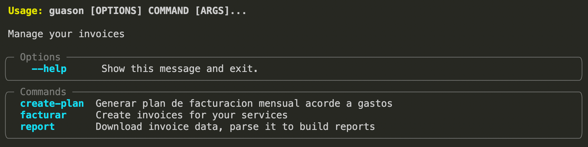

### Installation (Unix only for now)
`bash install_unix.sh`

## Setup
```
cp .env.sample .env
# fill with your CUIL, PASSWORD and your FACTURADOR name as it's seen while clicking on 'emitir factura'
# If you have more than one Point of Sale, you can also set PUNTO_DE_VENTA
```

# Como usarlo?



## Quiero facturarle a todos mis pacientes desde un Excel
#### `guason facturar sol`
> Emite una factura por cada paciente cargado en el Excel `pacientes.xlsx` del escritorio. Emite una **Factura C** como psicóloga (actividad 04) a **consumidor final**, con el CUIT del paciente. Por cada paciente factura el total (sesiones × honorarios por sesión), tomando la cantidad de sesiones, los honorarios y el medio de pago del Excel. El CUIL y el facturador se leen del `.env`.
>
> El Excel debe tener las columnas: `nombre y apellido | cuit | numero de sesiones | honorarios por sesion | medio de pago | total`


## Quiero descargar los comprobantes de todas mis facturas en cierto rango de fechas
#### `guason report download START END --destination comprobantes`
> Descarga facturas emitidas desde la fecha START hasta la fecha END y las guarda en el destino especificado

## Quiero un reporte de todo lo facturado a partir de los comprobantes de facturas
#### `guason report build COMPROBANTESPATH --destination reports`
> Escribe un reporte csv y json a partir de la carpeta donde se encuentran las facturas

> Nota: Este comando depende de haber corrido y guardado los comprobantes previamente mediante `guason report download`

## Quiero un reporte de mis ganancias por mes
#### `guason report earnings CSVREPORT`
> Genera un csv `facturacion_por_mes.csv` con el total facturado por mes a partir de un reporte previamente generado


## Quiero que me diga cuánto deberia facturar segun mis gastos mensuales
#### `guason create-plan --gastomensual GASTOMENSUAL`
> Genera un plan de facturacion mensual acorde a tus gastos, facturando solo los dias habiles y variando los montos diarios. Tambien podés usar `--categoria CATEGORIA` en lugar de `--gastomensual`.

## Quiero ver las categorias del monotributo y sus topes
#### `guason categorias`
> Lista cada categoria del monotributo con su facturacion maxima mensual y anual
